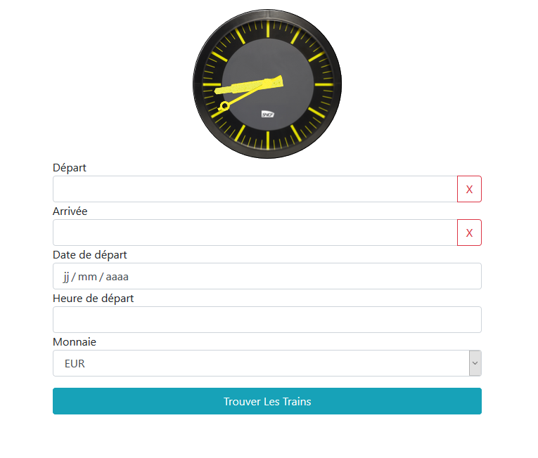
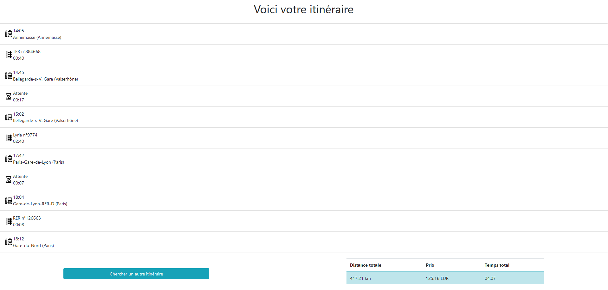

# SNCF-Flask-webapp :bullettrain_front:
A flask web-app that interrogates the navitia api to retrieve journeys and calculate the distance of the route by interrogating a homemade SOAP Service. it also interrogates an homemade REST-API to convert currencies.




### [Demo](http://trouvetontrain.herokuapp.com)

##### You can find REST API Swagger documentation : [here](http://trouvetontrain.herokuapp.com/restservice)
##### You can find SOAP Service documentation : [here](http://trouvetontrain.herokuapp.com/soapservice/distance/)

# Requirements

ladon (SOAP Service), zeep (SOAP Client), flask, flask_restplus (REST Service)

```
pip install -r requirements.txt
```

## APIs used

SNCF API + Foreign exchange rates API


# Setup

### Launch :

```
python dispatcher.py
```

# Credits

I would like to thank HashtagCheminot for his beautiful Pendule.
Here's the link to his profile : https://jsfiddle.net/user/HashtagCheminot/fiddles/
